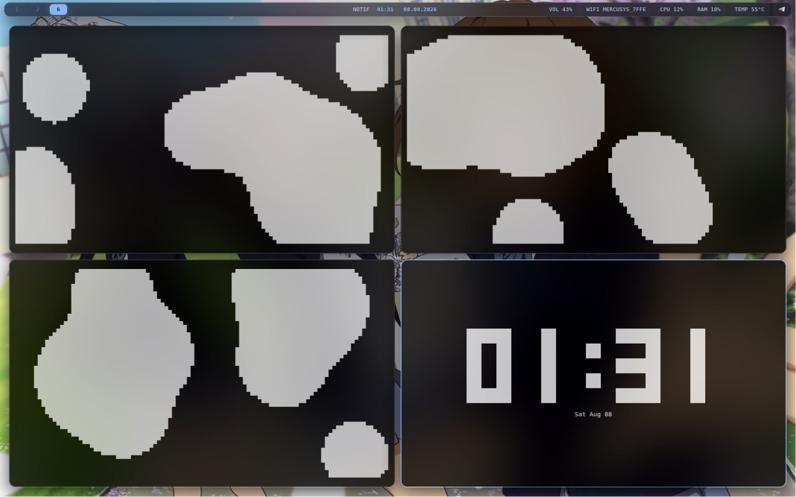

# swayfx-enhanced-dot

SwayFX enhanced dotfiles on Void Linux. Minimalist, fast, and fully optimized desktop environment. Features smooth window effects, blur, rounded corners, custom keybindings, and an efficient python auto-layout script (`auto_layout.py`) for automatic dynamic window splitting. Light on resources, built for speed and pure functionality.

## Components & Configs

- **WM:** SwayFX Enhanced
- **Status Bar:** Waybar
- **App Launcher:** Wofi
- **Screen Lock:** Swaylock
- **Notifications:** Mako
- **OSD:** SwayOSD
- **Logout Menu:** Wlogout
- **Automation:** Custom `auto_layout.py` script for dynamic window splitting

## Quick Start

  
    git clone https://github.com/iusedevuanbtw/swayfx-enhanced-dot.git ~/.config/sway-dots
